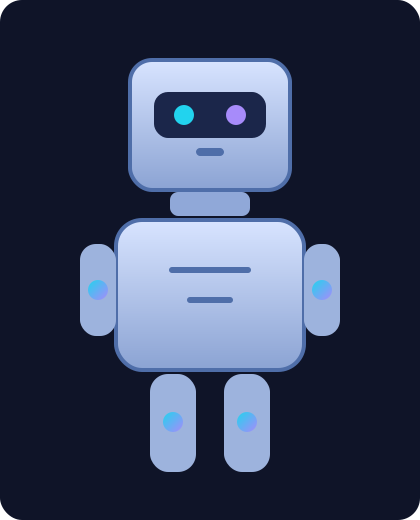

# Glitch — intelligently artificial

## Meet Glitch

The world is full of advice on how you *should* use AI—what tools to use, why your approach is wrong, and what you should pick instead.

If I’m honest, none of that matters as much as this: understanding the layers of AI, and how **you** can use those principles to change the world around you.

You don’t need to be a genius to start. You just need curiosity:

- Curiosity about how AI works
- Curiosity about how it makes decisions
- Curiosity about how to apply it in real life

Worried you aren’t clever enough?
Wondering where to begin?

Here’s the truth: you *are* clever enough. That’s exactly why this repository is laid out in **8 clear stages**, with practical examples at every step.

This pack is designed to take your AI understanding to the next level, showing you eight layers of applied AI in a way that’s tangible and useful.

By the end, you’ll have:

- A stronger mental model for how AI systems mature
- A framework to test your own understanding
- A practical way to assess the maturity of AI systems you work with

Good luck—you’ve got this.

---

## Start Here

- **Workshop overview (main guide):** [README_WORKSHOP_FUN.md](README_WORKSHOP_FUN.md)
- **Yegge’s 8 layers explained (beginner-friendly):** [README_YEGGE_8_LAYERS_EXPLAINED.md](README_YEGGE_8_LAYERS_EXPLAINED.md)
- **How examples align to capability stages:** [examples/STAGES_ALIGNMENT_README.md](examples/STAGES_ALIGNMENT_README.md)

---

## The 8 Example Chapters

Follow the climb level-by-level in the shared customer support scenario:

1. [Level 1 README](examples/level1/README.md)
2. [Level 2 README](examples/level2/README.md)
3. [Level 3 README](examples/level3/README.md)
4. [Level 4 README](examples/level4/README.md)
5. [Level 5 README](examples/level5/README.md)
6. [Level 6 README](examples/level6/README.md)
7. [Level 7 README](examples/level7/README.md)
8. [Level 8 README](examples/level8/README.md)
