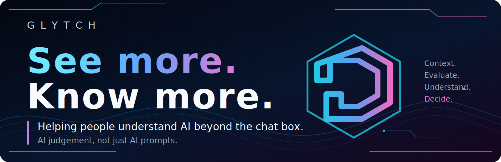

# Glytch for Schools

Helping people understand AI beyond the chat box.

Glytch is a workshop-safe AI fluency demo that helps schools teach AI judgement, not just AI prompts.

It gives staff and students a safe way to see how AI-supported work changes when structure, evidence, checks and human review are added.

## What this pack is for

Use this pack to run AI literacy sessions with:

- high school students
- sixth form students
- teachers and teaching assistants
- digital leads
- senior leadership teams
- governors
- careers and employability teams
- school support and admin teams

The same demo can be used at different depths. With students, keep the focus on learning, checking and responsible use. With staff and leaders, use it to build a shared language for safe AI adoption.

## The core message

AI should support learning, not replace thinking.

Glytch helps people understand:

- what the AI is being asked to do
- what information it is using
- what needs checking
- where human judgement belongs
- when simple help is enough
- when more structure is needed
- why more automation is not always better

## How this relates to UNESCO AI competency frameworks

Glytch is not affiliated with UNESCO and is not endorsed by UNESCO.

It is designed to support the same broad AI literacy themes found in UNESCO’s AI competency frameworks for students and teachers: human-centred use, ethical judgement, critical thinking, safe practice, and understanding how AI systems work.

UNESCO’s AI competency frameworks encourage students and teachers to understand both the potential and risks of AI so they can engage with it in a safe, ethical and responsible way.

Glytch supports these themes by helping students and staff explore:

- what the AI is being asked to do
- what information it is using
- what needs checking
- where human judgement belongs
- why AI should support learning, not replace thinking

Useful UNESCO references:

- [UNESCO: AI competency frameworks for students and teachers](https://www.unesco.org/en/digital-education/ai-future-learning/competency-frameworks?hub=66966)
- [UNESCO: AI competency framework for students](https://www.unesco.org/en/articles/ai-competency-framework-students)
- [UNESCO: AI competency framework for teachers](https://www.unesco.org/en/articles/ai-competency-framework-teachers)

## The simple learning model

Glytch shows a journey from basic AI help to checked work:

Prompt → Tool → Check → Evidence → Review → Controlled work

For school use, explain it like this:

| Step | Plain English meaning |
|---|---|
| Prompt | Ask AI for help |
| Tool | Let AI use a helper, such as a calculation or lookup |
| Check | Look for mistakes or weak assumptions |
| Evidence | Tie the answer to trusted material |
| Review | A person checks before using it |
| Controlled work | More steps, more checks, more responsibility |

## Recommended school sessions

### 20-minute taster

Use this when time is tight.

- Show Level 1.
- Show Level 3.
- Ask what changed.
- Discuss what should be checked before using an AI answer.

### 45–60 minute lesson or CPD session

Use this for a normal class, staff meeting or workshop.

- 0–5 mins: Introduce AI beyond the chat box.
- 5–10 mins: Ask what people already use AI for.
- 10–20 mins: Run Level 1 and discuss simple prompting.
- 20–30 mins: Run Level 3 and discuss tools and checks.
- 30–40 mins: Run Level 4 or Level 6 and discuss evidence and review.
- 40–50 mins: Run Level 8 and discuss limits and human judgement.
- 50–60 mins: Reflect on when AI helps and when it could make learning worse.

### 90-minute extended session

Use this for deeper student work or staff CPD.

- Run the standard session.
- Split into groups.
- Give each group a school scenario.
- Ask them to decide the safest level of AI help.
- Share what should be checked before using the output.

## School-safe principles

- Do not enter personal pupil data.
- Do not enter sensitive school data.
- Do not treat AI answers as automatically correct.
- A human should check outputs before they are used.
- AI should support learning, not replace thinking.
- The demo is simulated and workshop-safe.
- No real emails are sent.
- No files are changed.
- No real-world actions are taken.

Schools should follow their own policies and relevant safeguarding, data protection and AI guidance.

## Suggested school scenarios

Use generic examples. Do not use real pupil data.

Good examples:

- planning a revision timetable
- improving a paragraph for clarity
- creating quiz questions from teacher-provided notes
- comparing a simple answer with an evidence-based answer
- planning a careers research task
- preparing questions for a debate
- improving a draft explanation
- planning a safe school club activity

## What Glytch is not

Glytch is not:

- a homework machine
- a replacement teacher
- a safeguarding system
- a production automation tool
- tied to one AI company
- a reason to skip human review

## Files in this school pack

- [Facilitator guide](FACILITATOR_GUIDE.md)
- [Student activity sheet](STUDENT_ACTIVITY_SHEET.md)
- [Safe use in schools](SAFE_USE_IN_SCHOOLS.md)
- [SLT one-page brief](SLT_ONE_PAGE_BRIEF.md)
- [Workshop guide](README_WORKSHOP_GUIDE.md)

## One-line summary

Glytch is a safe way for schools to teach AI judgement, not just AI prompts.
