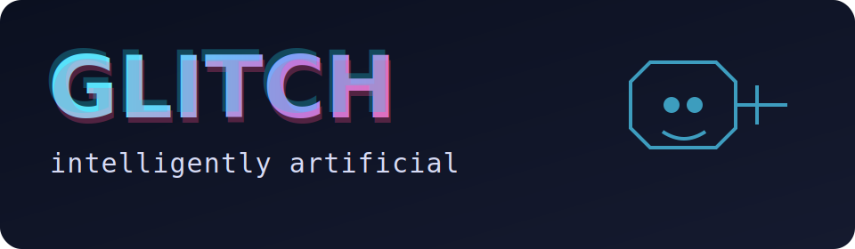

The Glitch workshop is for people who are curious about AI and want to understand how real AI systems are built—from simple prompts to reliable production workflows.

If you’ve ever wondered:

- Why an AI answer is great one time and off the next.
- When to use tools, retrieval, or agent-like workflows.
- How to move from demo-quality AI to production-quality AI.

the Glitch workshop is for you.

---

## What the Glitch workshop is

A practical learning experience that walks through **8 levels of AI capability** using one shared scenario:

> Improving customer support response quality for a SaaS product.

Using one scenario across all levels makes it easy to see what each architecture adds and why it matters.

---

## What you’ll learn

By the end, you’ll be able to:

- Explain the difference between Levels 1–8 in plain language.
- Compare quality, reliability, speed, and cost across levels.
- Identify common failure modes (hallucinations, brittle flows, over-engineering).
- Choose a right-sized architecture for a real production use case.

---

## The 8 levels (quick view)

1. **Autocomplete** – fast but inconsistent.
2. **Instruction Following** – clearer structure.
3. **Tool Use** – reliable calculations and lookups.
4. **Retrieval + Grounding** – better factual accuracy.
5. **Multi-step Reasoning** – stronger decomposition.
6. **Agentic Loop** – iterative refinement.
7. **Multi-agent Collaboration** – role-based quality improvements.
8. **Self-improving Workflow** – feedback-driven evolution.

---

## Workshop flow

- **Intro + setup:** 20 min
- **Levels 1–4:** 60 min
- **Levels 5–8:** 60 min
- **Debrief + design discussion:** 30–60 min

Recommended total: **2.5–4 hours**.

---

## Who the Glitch workshop is for

Great for:

- Students learning how modern AI systems work
- Curious builders and self-learners
- Early-career professionals exploring AI product design
- Teams building AI features for real users

Prerequisite: basic comfort with Python and web apps.

---

## Quick start

```bash
export OPENAI_API_KEY="your_key_here"
python app.py
```

Then open: <http://127.0.0.1:8000> and work through Levels 1–8.

---

## Why this matters

The Glitch workshop helps people move beyond AI hype and make practical decisions.

You’ll leave with a shared framework to answer:

- What level do we actually need?
- What are we overbuilding?
- Where are the biggest reliability gains for the effort?
- What should be in place before production rollout?

---

## Outcome

The core outcome is simple: teams stop arguing in abstractions and start making evidence-based architecture decisions.

