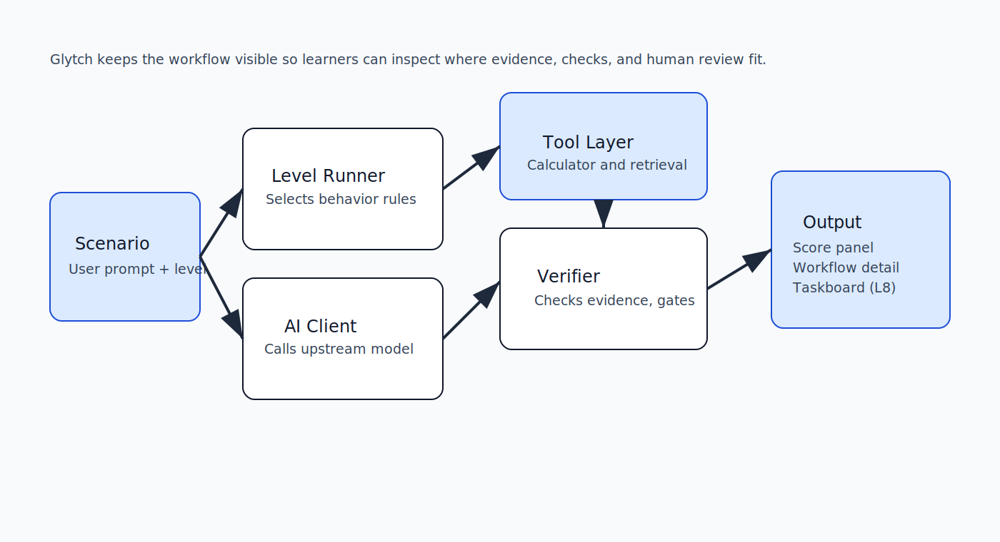
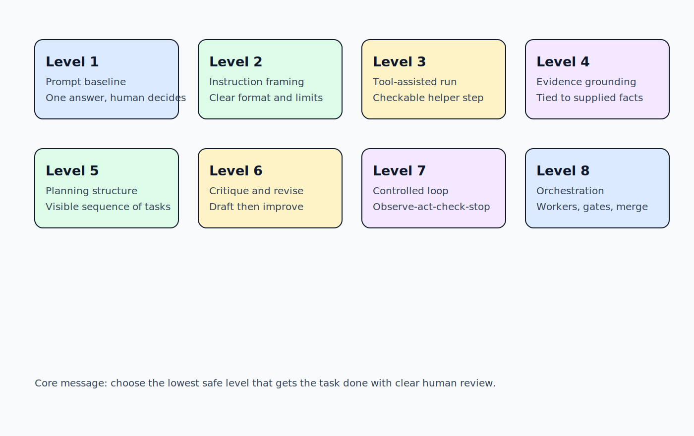
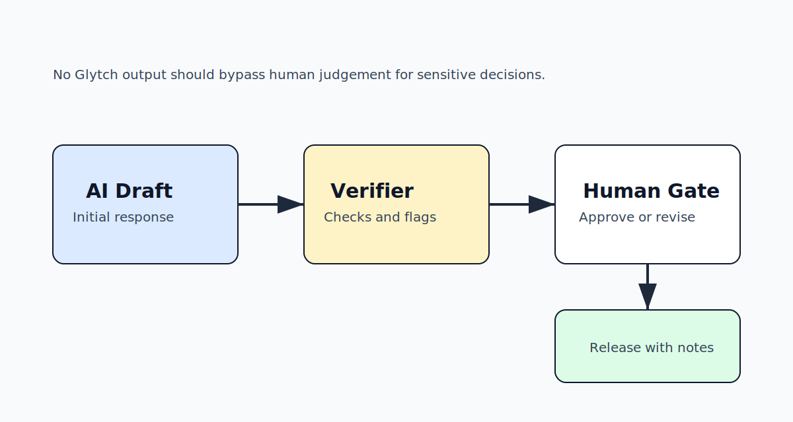

<p align="center">
  
</p>

<p align="center">
  <a href="../README.md">Home</a> •
  <a href="first_lesson_walkthrough.md">First Lesson Walkthrough</a> •
  <a href="teacher_guide.md">Teacher Guide</a> •
  <a href="student_worksheet.md">Student Worksheet</a> •
  <a href="architecture.md">Architecture</a> •
  <a href="how_llms_work.md">How AI Workflows Work</a>
</p>

---

# Architecture

## System diagram



---

## Core components

| Layer | Responsibility |
|---|---|
| `web/` | Browser UI, level selection, run rendering |
| `app.py` | HTTP server and API endpoints |
| `src/levels.py` | Level behavior contracts |
| `src/ai_client.py` | Upstream model requests and safe error mapping |
| `src/tools.py` | Bounded helper tools |
| `src/orchestrator.py` | Level 8 worker coordination model |

---

## Request flow

```text
User scenario + level
  -> API validation
  -> level runner
  -> optional tool/evidence path
  -> verifier checks
  -> structured response payload
  -> score panel + workflow detail + taskboard
```

---

## Trust boundaries

- Browser input is untrusted and validated.
- Levels are bounded by server-side policy.
- Tool calls are constrained and auditable.
- Errors are normalized to reduce leakage risk.
- Final outputs remain simulation outputs for learning.

---

## Level progression model



Each level adds workflow structure, not guaranteed quality.

Core principle: use the lowest safe level that gets the task done.

---

## Human review gate



No level removes the need for human judgement on high-stakes decisions.

---

## Observability surfaces in the UI

- score panel: capability, control, and alignment indicators
- simulation trace: readable run narrative
- workflow detail: step-by-step actor/status sequence
- replay: re-visualization without re-running
- taskboard (Level 8): worker outcomes, verifier state, merge decision

---

## Design constraints

- workshop-safe simulation focus
- no real-world external side effects from demo flow
- stable schema across levels for teaching comparability
- plain-language explanations in UI and docs

---

<p align="center">
  <a href="../README.md">Home</a> •
  <a href="first_lesson_walkthrough.md">First Lesson Walkthrough</a> •
  <a href="teacher_guide.md">Teacher Guide</a> •
  <a href="student_worksheet.md">Student Worksheet</a> •
  <a href="architecture.md">Architecture</a> •
  <a href="how_llms_work.md">How AI Workflows Work</a>
</p>
